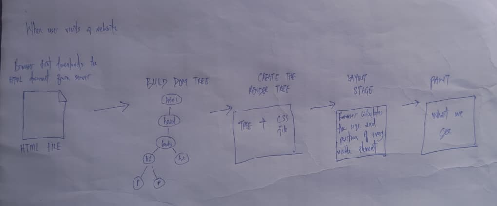
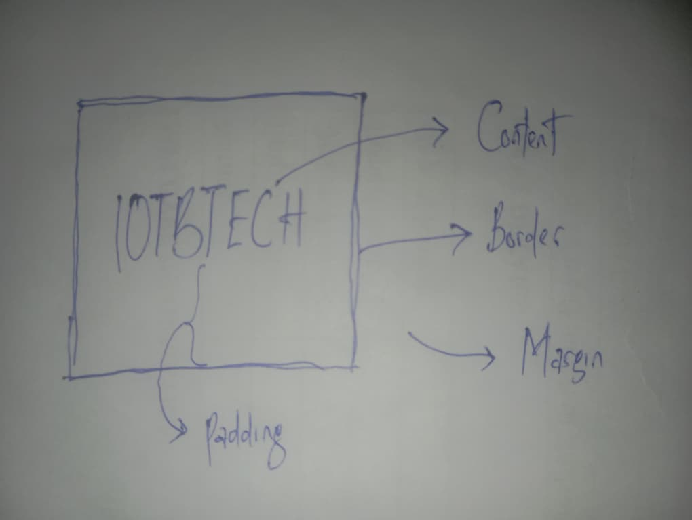
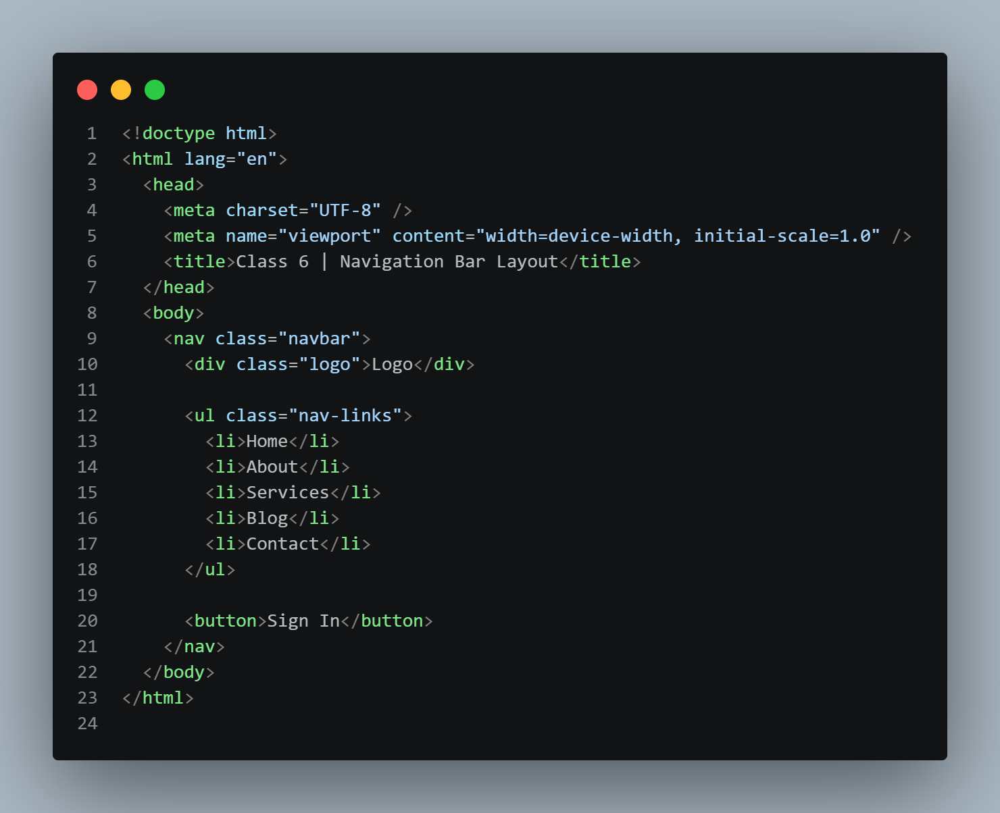
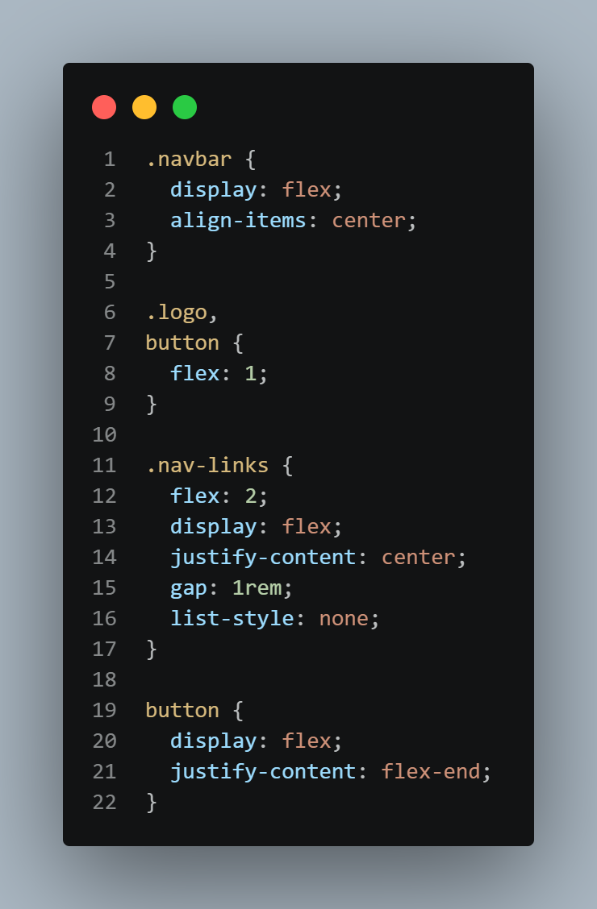

# Reflection Journal

## Class 01 - The 2026 Web Ecosystem

### Theory

#### 1. Browser Rendering Process



Understanding this process is important because it helps developers build faster and more efficient websites. And to also improve the overall user experience. It also helps when debugging layout and performance issues.

#### 2. HTTP/3 and QUIC

With older protocols, if one packet of data was delayed or lost, other packets often had to wait before they could be processed. This could slow down websites, especially on unstable networks. QUIC reduces this problem by allowing multiple streams of data to move independently. If one stream experiences an issue, the others can continue without being blocked. It also combines security and connection setup into a faster process, helping websites load more quickly.

For users in 2026, this means better performance, pages load faster, videos buffer less often, and online applications feel more responsive.

#### 3. Semantic HTML Observation

Suprisignly a website I stumbled upon that does not use sematic HTML was netflix, when I inspected their landing page. While browsing it, of course all the contents looked visually correct and appealing, but inspection told a different story. As everything I saw was just a bunch of divs and a lot of it at that. The underlying clue I could present was the basic fact that I inspected the page, another clue was that some sections appeared important visually but did not seem properly organised when inspected using browser developer tools. This could make it difficult for screen readers and search engines to understand the content. Semantic HTML helps provide meaning to content. Using elements such as header, nav, main, section, and footer makes a website easier to understand for both users and machines. When these elements are missing, accessibility and SEO can suffer even if the website looks fine on the screen.

### Product Thinking

#### 1. Semantic HTML and SEO

If I were building a blog for a famous chef who wants more traffic, I would make sure semantic HTML is used properly throughout the website. Search engines rely on structure to understand content, and semantic tags provide useful context.

The main content of each recipe or article would be placed inside an article element. The page title and important information would be placed inside a header element. The primary content area would be wrapped in a main element, while related content such as popular recipes or cooking tips could be placed inside an aside element.

#### 2. Edge Computing for Multiplayer Games

If I were designing a real-time multiplayer game, one of the biggest benefits of edge computing would be lower latency since players expect their actions to appear instantly on the screen, especially in competitive games. By then processing information closer to where players are located, edge computing can reduce the time it takes for data to travel between players and servers. This leads to faster responses and smoother gameplay.

Another benefit would be improved reliability. If servers are distributed across multiple locations, players can connect to the nearest one instead of relying on a single distant server. This can help reduce lag and provide a better gaming experience for users around the world.

### Engineering Best Practice

#### 1. Using divs Everywhere

I do not completely agree with using divs for everything. While a div can be used to create almost any layout, relying on divs alone removes a lot of useful meaning from the page structure.

Accessibility is one reason why semantic elements are important. Screen readers use semantic tags to understand different sections of a page. A main element clearly identifies the primary content area, while a nav element identifies navigation links. When everything is a div, assistive technologies lose that extra information.

Semantic HTML also helps with SEO because search engines can better understand the content and structure of a page. From a maintenance perspective, semantic elements make code easier to read also because for collaboration and long-term projects, semantic HTML creates cleaner and more organised code. Divs still have their place, but they should be used when no suitable semantic element exists rather than for every part of a website.

---

## Class 02 - Typography & Information Hierarchy

### Theory

#### 1. Difference Between em and i

The <em> and <i> tags may look similar because browsers often display both in italics, but they have different meanings. The em tag is used when a word or phrase needs emphasis. It tells both users and assistive technologies that the content is important and should be stressed. The i tag on the other hand is mainly used for text that is different from the surrounding content without adding importance.

For example, if I write "I need to finish this assignment today," I could use em on the word "need" to show emphasis. If I am mentioning a foreign word like "ekaro," I could use the i tag because it is a word from another language.

Understanding the difference helps create more meaningful and accessible content.

#### 2. HTML Elements With Special Screen Reader Behaviour

- Button element: Screen readers immediately recognize it as a button that can be clicked or activated.

- Heading elements such as h1, h2, and h3: Screen readers use headings to help users move around a page and understand the content structure.

- Input element used in forms: Screen readers identify it as a field where users can enter information.

Browsers treat these elements specially because they provide important information about the purpose of the content. This helps users who rely on assistive technologies navigate websites more easily.

#### 3. ARIA Labels vs Semantic HTML

ARIA labels are useful when an element needs a description that is not visible on the screen. For example, if a navigation menu only shows a hamburger icon, I can use an aria-label like "Open navigation menu" so screen reader users know its purpose.

However, ARIA should not be used to replace proper HTML structure. If a div is used as a button, adding an aria-label does not make it as good as using a real button element. In that situation, the better solution is to fix the HTML and use the correct semantic element.

### Accessibility Reflection

#### 1. Accessibility Audit

I tested the my color space homepage using keyboard navigation. I was able to move around the page using the Tab key and clearly see which element was currently selected.

The buttons on the page were also accessible through keyboard navigation and when I pressed enter on them they were successfully clicked and the the saem thing had it been clicked with a mouse. The page structure felt really simple and organized.

A major thing observed also was that the website places a strong focus on keyboard accessibility. Users can navigate important parts of the page without needing a mouse that much. Overall, the accessibility experience was good and showed how proper HTML and accessibility practices can improve usability.

### Product Thinking

#### 1. API Documentation Hierarchy

If I were designing documentation for an API

- The h1 heading would contain the name of the API and a short overview.
- The h2 headings will be used for different sections such as Authentication, Endpoints, Error Handling etc.
- h3 headings could be used under each section for specific topics. For example, under Endpoints there could be headings such as Get Users, Create User, Update User, and Delete User.

---

## Class 03 - Modern Assets & Linking

### Theory

#### 1. Optimizing a 5 MB PNG Hero Image

If a designer gives me a 5 MB PNG image for a hero section, the first thing I would do is check if PNG is really necessary. If the image is a normal photograph

- I would convert it to a modern format like WebP or AVIF because these formats usually provide much smaller file sizes while keeping good quality.
- Next, I would resize the image to the maximum size needed on the website. There is no reason to upload a huge image if users will only see it in a smaller space.
- After resizing, I would compress the image using tools such as TinyPNG.

#### 2. Understanding srcset

The srcset attribute allows the browser to choose the most appropriate image size for a user's device. Instead of sending the same image to everyone, the browser can pick a smaller image for mobile users and a larger image for desktop users.

For example, imagine an online store with product images. If a mobile user only needs a small image, downloading a large desktop image would waste data and slow down the page. With srcset, the browser can automatically choose a smaller version. This improves loading speed, saves bandwidth, and creates a better experience for users on slower internet connections or mobile devices.

#### 3. Why rel="noopener" Matters

When using target="\_blank", a new browser tab is opened. Without rel="noopener", the newly opened page can sometimes access information about the page that opened it.

In simple terms, imagine giving a stranger access to the controls of your car while you are still driving it. That is not something you would want to happen.

Adding rel="noopener" prevents the new page from being able to control or interact with the original page. This improves security and helps protect users from certain types of attacks.

### Engineering Thinking

#### 1. Strategy for Displaying 50 Product Images

If I need to display 50 product images on a page, I would focus on performance and user experience.

- I would use modern image formats like WebP to reduce file sizes. Next, I would use lazy loading so images only load when users scroll close to them. This prevents the browser from downloading all 50 images immediately.

I would also use responsive image sizes so mobile users do not download large desktop images. Using a CDN would help deliver images from servers closer to users, improving loading speed.

Finally, I would compress all images before uploading them. Combining these techniques would help the page load faster and feel more responsive for users.

#### 3. Why rel="noopener" Matters

When using target="\_blank", a new browser tab is opened. Without rel="noopener", the newly opened page can sometimes access information about the page that opened it.

In simple terms, it's almost like giving a stranger access to the controls of your car while you are still driving it. Adding rel="noopener" prevents the new page from being able to control or interact with the original page. This helps protect users from certain types of attacks.

### Engineering Thinking

#### 1. Strategy for Displaying 50 Product Images

If I need to display 50 product images on a page, I would focus on performance and user experience.

- I would use modern image formats like WebP to reduce file sizes.
- I would use lazy loading so images only load when users scroll close to them. This prevents the browser from downloading all 50 images immediately.
- I would also use responsive image sizes so mobile users do not download large desktop images.

---

## Class 05 - The CSS Engine: Box Model & Specificity

### Theory

#### 1. CSS Box Model



If one div has a margin-bottom of 20px and another div has a margin-top of 30px, the space between them will be 30px, not 50px. This happens because vertical margins collapse and the larger margin wins.

#### 2. CSS Specificity

Specificity is how the browser decides which CSS rule to apply when multiple rules target the same element.

For the given selectors:

```css
.header nav ul li a
nav a.active
.nav-links a
```

Using the 4-column calculator:

- Inline Styles = (1,0,0,0): Applied directly to the HTML element via the style attribute.
- IDs = (0,1,0,0): (e.g., `#header`).
- Classes, Attributes, and Pseudo-classes = (0,0,1,0): (e.g., `.nav`, `[type="text"]`, `:hover`, or `:active`).
- Elements and Pseudo-elements = (0,0,0,1): (e.g., `div`, `nav`, `a`, `::before`)

**Calculations**

For `.header nav ul li a`
Classes: 1 (.header)
Elements: 4 (nav, ul, li, a) 1 each
Score: (0, 0, 1, 4)

For `nav a.active`
Classes/Pseudo-classes: 1 (.active)
Elements: 2 (nav, a)
Score: (0, 0, 1, 2)

For `.nav-links a`
Classes: 1 (.nav-links)
Elements: 1 (a)
Score: (0, 0, 1, 1)

`.header nav ul li a` because of the tie of all selectors for the first 3 columns, the fourth columns will be like a tie breaker and `.header nav ul li a` has 4 elements, which beats out the 2 elements of the second selector and the 1 element of the third.

#### 3. What is the CSS Cascade?

The cascade is the process the browser uses to decide which CSS rule should be applied.

For example, if I have two rules styling the same button, the browser checks things like specificity and the order of the rules.

Understanding the cascade helps me avoid writing extra CSS when a simple change would solve the problem.

### Engineering Thinking

#### 1. Padding Makes an Element Wider

This usually happens because the default box model adds padding to the element's width. For example, if an element has a width of 200px and I add 10px padding on both sides, the total width becomes larger than 200px.

A common fix is using: `box-sizing: border-box`. This makes the padding stay inside the specified width.

#### 2. Content-Box vs Border-Box

Content-box is the default box model where padding and borders increase the final size of an element.

Border-box includes the padding and border inside the width and height that you set.

I prefer border-box because it makes layouts easier to manage and more predictable.

---

## Class 06 - Flexbox Mastery

### Theory

#### 1. Difference Between flex-grow, flex-shrink, and flex-basis

I think of Flexbox like sharing space in a room. For example, if three people are sharing a room, flex-basis is the space they start with, flex-grow is how much extra space they can get, and flex-shrink is how much space they can give up when the room becomes crowded.

- `flex-grow` decides how much extra space an item can take when there is free space available.
- `flex-shrink` decides how much an item can reduce in size when there is not enough space.
- `flex-basis` is the starting size before grow or shrink happens.

#### 2. When align-items: stretch Does Not Work

`align-items: stretch` only works when the item does not already have a fixed height. In this example below, the item already has a height of 100px, so it will not stretch to fill the container. The fixed height prevents the stretching behavior.

Example:

```css
.container {
  display: flex;
  align-items: stretch;
}

.item {
  height: 100px;
}
```

### Engineering Thinking

#### 1. Navigation Bar Layout

Referencing the screenshot below, my thinking was to divide the navbar into three sections. The logo stays on the left, the links stay in the middle, and the sign-in button stays on the right. Using flex values helps keep the links centered even if the logo or button changes width.

**HTML Structure**



**Flexbox Solution**



#### 2. Instagram Header Using Flexbox

To build the Instagram header, I would place all navigation items inside a Flexbox container.

On large screens, all menu items would be displayed in a row. On smaller screens, I would hide the menu items and show a hamburger menu instead.

Flexbox would help keep the spacing consistent and make the layout easier to manage across different screen sizes. I would also test the layout on mobile, tablet, and desktop screens to make sure everything remains usable and easy to navigate.

---

## Class 07 - CSS Grid & Layout Complexity

### Theory

#### 1. When to Choose CSS Grid Over Flexbox

I would choose CSS Grid when working with layouts that have both rows and columns. Flexbox works best in one direction at a time, while Grid is better for full page layouts.

Some examples are:

1. A dashboard with KPI cards.
2. A product dashboard featuring customers' testimonials in cards.
3. A photo gallery where items need to be arranged in rows and columns.

#### 2. grid-template-areas vs grid-template-columns

I would use `grid-template-columns` when I only need to define column sizes.

Example:

```css
grid-template-columns: 1fr 2fr 1fr;
```

I would use `grid-template-areas` when I want to visually describe the layout. I think grid-template-areas makes complex layouts easier to understand because the layout can be seen directly in the code as shown in the example code below.

Example:

```css
grid-template-areas:
  "card1 card1 card2"
  "card3 card4 card6"
  "card3 card5 card6";
```

card1 spans 2 columns 1 row
card2, card4, and card5 span 1 row 1 column
card3 and card6 span 2 rows 1 column

### Engineering Thinking

#### 1. Magazine Layout

**ASCII Sketch**

```text
+------------------------------------------------------+
|                   HERO ARTICLE                       |
+------------------------------------------------------+

+---------------------------+--------------------------+
|          WIDE ARTICLE 2   | WIDE ARTICLE 3           |
+---------------------------+--------------------------+
+------------------------------------------------------+
|                   WIDE ARTICLE                       |
+------------------------------------------------------+

+-----------------+-----------------+------------------+
| SMALL ARTICLE 1 | SMALL ARTICLE 2 | SMALL ARTICLE 3  |
+-----------------+-----------------+------------------+
```

**Grid Layout**

```css
.container {
  display: grid;
  gap: 1rem;

  grid-template-columns: repeat(3, 1fr);

  grid-template-areas:
    "hero hero hero"
    "a2    a2   a3"
    "wide wide wide"
    "s1    s2   s3";
}

.hero {
  grid-area: hero;
}

.article-2 {
  grid-area: a2;
}

.article-3 {
  grid-area: a3;
}

.wide {
  grid-area: wide;
}

.small-1 {
  grid-area: s1;
}

.small-2 {
  grid-area: s2;
}

.small-3 {
  grid-area: s3;
}
```

I used `fr` units because they divide available space evenly and make the layout responsive.

#### 2. Responsive Dashboard Layout

---

## Class 08 - Tailwind CSS Fundamentals

### Theory

#### 1. Utility-First Philosophy

According to my understanding, instead of creating custom CSS classes for every component, Tailwind allows us to use small utility classes directly in the HTML making styling faster and more convinient.

For example, instead of creating a class called `.button` and then proceeding to styling it by doing

```css
.button = {
  `background-color: #000000`;
  color: #ffffff;
  padding: 12px 24px;
}
```

One can simply use these tailwind utility classes to achieve the same results, inline and faster `bg-black` (or `bg-[#000000]`), `text-white` (or `bg-[#FFFFFF]`), and `p-4` respectively. I believe this approach helps developers build interfaces faster and keeps styling consistent across a project.

#### 2. What is the JIT Compiler?

JIT means Just-In-Time compiler.

It generates only the CSS classes that are actually used in the project. This helps keep the final CSS file smaller. Without JIT, many unused styles might be included. With JIT, only the classes being used are generated and in turn reduces file size.

### Product Thinking

#### 1. Responding to a Teammate Who Says Tailwind Makes HTML Ugly

Well, it's understandable that Tailwind makes HTML look crowded because there can be many classes on a single element, but then again, the benefits far outweighs this particular drawback as it keeps styles close to the element being styled, which means one do not have to switch between HTML and CSS files constantly. And also most importantly, it also helps teams stay consistent because everyone uses the same utility classes instead of creating different custom styles for similar elements.

### Engineering Thinking

#### 1. Card Component in Different States

Default Card

```html
<div class="border rounded-lg p-6">Default State</div>
```

Hover Card: this lifts slightly and adds a shadow when the mouse moves (hovers) over it

```html
<div
  class="border rounded-lg p-6 hover:shadow-lg hover:-translate-y-1 transition"
>
  Hover State
</div>
```

Featured Card: this has larger width and has a stronger border thickness so it stands out from the others

```html
<div class="border-2 border-[#FAFAF9] w-2xl rounded-xl p-6 shadow-lg">
  Featured State
</div>
```

---

## Class 09 - Advanced Tailwind & Responsive Design

### Theory

#### 1. Tailwind Breakpoint System

Tailwind uses breakpoints to apply styles at different screen sizes.

For example:

```html
<div class="text-[12px] md:text-[20px]">Hello World</div>
```

The text will have a size of 12 pixels on mobile screens and 20 pixels on medium screens and above.

The `md:` prefix means the style starts applying when the screen reaches the medium breakpoint.

To create a custom breakpoint for 1200px, I can add it in the Tailwind configuration to override the default breakpoint configuration:

```js
module.exports = {
  theme: {
    extend: {
      screens: {
        xl: "1200px",
      },
    },
  },
};
```

#### 2. Arbitrary Values

Arbitrary values allow us to use custom values directly inside a class. I would use arbitrary values when I need a specific value only once. If the same value will be used many times, I think it is better to add it to the Tailwind configuration so the project stays organized.

### Engineering Best Practice

#### 1. Tailwind Dark Mode Configuration

For latest version of Tailwind, Tailwind v4, the `@theme` and `@variant` dark syntax below handles everything natively.

Example configuration:

```css
@theme {
  /* Light mode variables by default */
  --color-bg: #ffffff;
  --color-text: #000000;

  /* Dark mode variables overrides */
  @variant dark {
    --color-bg: #0f172a;
    --color-text: #fafaf9;
  }
}
```

And then I'll use them as such

Example usage:

```html
<div class="bg-white text-black dark:bg-black dark:text-white">
  Example Usage
</div>
```

#### 2. Responsive Startup Landing Page

Using Tailwind, and knowing it defaults to a mobile first approach, my breakpoint strategy will be

- Mobile First: Default styles from 0px and up
- `sm:` mobile (large phones) < 640px from 640px and up
- `md:` tablets from 768px and up
- `lg:` desktop from 1024px and up

---

## Class 10 - Memory & Variables

### Theory

#### 1. Difference Between let, const, and var

- `var` is function-scoped and can be reassigned.
- `let` is block-scoped and can also be reassigned. I use it when I know a value may change later.
- `const` is also block-scoped, but it cannot be reassigned after it has been declared. I use it for values that should stay the same.

One thing that confused me at first was that `const` does not completely lock objects and arrays. On further study I got to understand that it does not prevent mutation because it secures the variable's assignment, not the value's content. Simply put, it only prevents the variable itself from being reassigned, the contents of the object or array however can still be changed.

#### 2. What is the Temporal Dead Zone (TDZ)?

The Temporal Dead Zone is the period between when a variable is created and when it is initialized.

I think TDZ is useful because it helps catch mistakes early and prevents bugs caused by accidentally using variables before they are ready like in the example below, will produce an error because `name` is inside the Temporal Dead Zone..

```js
console.log(name);

let name = "Ibrahim";
```

#### 3. Memory Heap vs Stack

# Memory Heap vs Stack

### Code

```javascript
let name = "Sarah";

let age = 22;

let scores = [90, 85, 88];

function greet(person) {
  return "Hello, " + person;
}

let result = greet(name);
```

### Memory Diagram

```text
STACK
------------------------------------------------
name      -> "Sarah"
age       -> 22
scores    -> Ref A
greet     -> Function
result    -> "Hello, Sarah"
------------------------------------------------


HEAP
------------------------------------------------
Ref A -> [90, 85, 88]
------------------------------------------------
```

JavaScript stores primitive values such as `strings`, `numbers`, `booleans`, and `references` directly in the `Stack` while more complex data types such as arrays and objects are stored in the `Heap`. Functions are also reference types, so the variable `greet` holds a reference to the function.

### Product Thinking

#### 1. Variables for a Calculator App

- For the display value, I would use `let` because the value changes whenever the user presses a number or operation button.
- For the operator, I would also use `let` because it changes depending on whether the user chooses addition, subtraction, multiplication, or division.
- For the previous operand, I would use `let` as well because the value changes during calculations.
- I would only use `const` for values that should never change during the life of the application.

---

## Class 11 - Control Flow & Comparison

### Theory

#### 1. Difference Between == and ===

The `==` operator checks if two values are equal after trying to convert their types while the `===` operator checks both the value and the type.

Example:

```js
5 == "5"; // returns true

5 === "5"; // returns false
```

Using `==` can sometimes cause unexpected results because JavaScript automatically converts values, which I believe is known as type coercion.

For example:

```js
0 == false; // true
```

Even though one is a number and the other is a boolean. Because of this, I prefer using `===` since it is more predictable.

#### 2. Optional Chaining (?.)

Optional chaining helps prevent errors when trying to access properties that may not exist. One downside is that overusing it can hide problems. If data is missing when it should exist, optional chaining may silently return `undefined` instead of helping us notice the issue.

Examples:

- `user?.name`
- `user?.address?.city`
- `user?.preferences?.theme`

#### 3. Nullish Coalescing (??)

The nullish coalescing operator provides a default value when the value on the left is `null` or `undefined`.

Example:

```js
let username = null;

console.log(username ?? "Guest");

// Output:
// Guest
```

It is different from `||` because `||` treats values like `0`, `false`, and empty strings as false.

Example:

```js
0 || 10;

// returns:
// 10

// But:

0 ?? 10;

// returns:
// 0

// In this case, `??` is the better choice because `0` is a valid value.
```

```js
// Input validation function
function validateUser(user) {
  const errors = [];

  if (!user.name || typeof user.name !== "string") {
    errors.push("Name is required");
  }

  if (typeof user.age !== "number" || user.age < 18 || user.age > 99) {
    errors.push("Age must be between 18 and 99");
  }

  if (!user.email || !user.email.includes("@")) {
    errors.push("Invalid email");
  }

  if (user.preferences && typeof user.preferences !== "object") {
    errors.push("Preferences must be an object");
  }

  const theme = user.preferences?.theme ?? "light";

  return {
    valid: errors.length === 0,
    errors,
    theme,
  };
}
```

```js
// Grade calculator
function calculateGrade(scores, weights, passingGrade) {
  if (scores.length === 0 || scores.length !== weights.length) {
    return "Invalid input";
  }

  let weightedTotal = 0;

  for (let i = 0; i < scores.length; i++) {
    weightedTotal += scores[i] * (weights[i] / 100);
  }

  const average = weightedTotal;

  const status = average >= passingGrade ? "Pass" : "Fail";

  const distinction = average >= 90 ? "Yes" : "No";

  let letterGrade;

  if (average >= 90) {
    letterGrade = "A";
  } else if (average >= 80) {
    letterGrade = "B";
  } else if (average >= 70) {
    letterGrade = "C";
  } else if (average >= 60) {
    letterGrade = "D";
  } else {
    letterGrade = "F";
  }

  return {
    average,
    status,
    letterGrade,
    distinction,
  };
}

console.log(calculateGrade([80, 90, 100], [30, 30, 40], 50));
```

---

## Class 12 - Functions & Functional Programming

### Theory

#### 1. Function Declaration vs Function Expression

A function declaration is created using the function keyword with a name while a function expression is when a function is stored inside a variable. eg.

```js
// Function declaration
function greet() {
  return "Hello World";
}

// Function expression
const greet = function () {
  return "Hello World";
};
```

Hoisting behaves differently between them because function declarations can be called before they appear in the code, while function expressions cannot simply because the function declaration is hoisted.

```js
// Call greet function before declaration
greet();

function greet() {
  console.log("Hello World");
}
```

#### 2. What is a Pure Function?

A pure function always gives the same output when given the same input. Developres value functions like this because it's output is simply what was expected and defined. If I pass in 2 and 3 in the function below, it will always return 5.

Example:

```js
function add(a, b) {
  return a + b;
}
```

An example of a function that is not pure is shown below. The function is mot pure because it changes a variable outside itself, so the result depends on something outside the function:

```js
let count = 0;

function increaseCount() {
  count++;
}
```

#### 3. Callbacks and Higher-Order Functions

- A callback is a function passed into another function.
- A higher-order function is a function that accepts another function or returns a function. eg. `map()`, `filter()`, `reduce()` etc.

They are fundamental in Javacript because they help us write reusable and flexible code.

### Product Thinking

#### 1. Pure Functions for a Calculator App

Some pure functions I would create are:

1. `add(a, b)` - adds two numbers (takes two arguments).
2. `subtract(a, b)` - subtracts one number from another (takes two arguments).
3. `multiply(a, b)` - multiplies two numbers (takes two arguments).
4. `divide(a, b)` - divides two numbers (takes two arguments).
5. `square(number)` - returns the square of a number (takes one argument).

Making them pure makes them easier to test and debug in case of any issues.

### Engineering Thinking

#### 1. Compose Function

The implementation for the compose function can be found in:

```js
function compose(f, g, h) {
  return function (x) {
    return f(g(h(x)));
  };
}
```

A compose function combines multiple functions into one function. The expression: `compose(f, g, h)(x)` means: `f(g(h(x)))` that is the functions are executed from right to left.

Using the example below:

```js
function add2(x) {
  return x + 2;
}

function multiply3(x) {
  return x * 3;
}

function subtract1(x) {
  return x - 1;
}

const result = compose(add2, multiply3, subtract1);

console.log(result(5));

/*
 Output explanation

x = 5

subtract1(5) = 4
multiply3(4) = 12
add2(12) = 14

Final result:

14
*/
```

#### 2. Using reduceRight

The `reduceRight()`, automatically processes an array from right to left. The implementation can be found in:

```js
function compose(...functions) {
  return function (x) {
    return functions.reduceRight((result, fn) => fn(result), x);
  };
}
```

---

## Class 13 - Data Structures: Arrays & Objects

### Theory

#### 1. When to Use an Array vs an Object

I would use an array when I need to store a list of similar items. eg.

`const fruits = ["Apple", "Banana", "Orange"]`

I would use an object however when I want to store something with properties using keys and values. eg.

```js
const user = {
  name: "Ibrahim",
  location: "Nigeria",
  role: "Student",
};
```

Arrays are better for lists, while objects are better for storing information about a specific thing.

#### 2. Destructuring Nested Objects

Destructuring allows us to extract values from objects and store them in variables.

Example:

```js
const response = {
  user: {
    profile: {
      name: "Ibrahim",
      email: "ibrahim@example.com",
    },
  },
};

const {
  user: {
    profile: { name, email },
  },
} = response;
```

After destructuring I can use:

```js
console.log(name);
console.log(email);
```

Instead of writing:

```js
response.user.profile.name;
response.user.profile.email;
```

This makes the code cleaner and easier to read.
